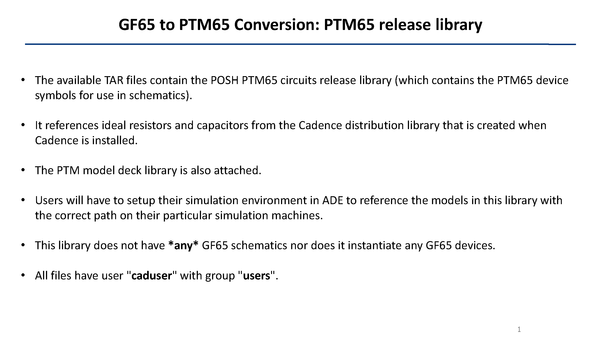

Copyright 2020

Licensed under the Apache License, Version 2.0 (the "License");
you may not use this file except in compliance with the License.
You may obtain a copy of the License at

    http://www.apache.org/licenses/LICENSE-2.0

Unless required by applicable law or agreed to in writing, software
distributed under the License is distributed on an "AS IS" BASIS,
WITHOUT WARRANTIES OR CONDITIONS OF ANY KIND, either express or implied.
See the License for the specific language governing permissions and
limitations under the License.

# Xyce-compatibility
There are 2 versions of the netlist, located in the "Xyce" folder: test_opamp.cir and test_opamp_gain.cir
## test_opamp.cir
This netlist can be used to compute gain from V(dolout) as a post-process in gnuplot.
## test_opamp_gain.cir
This netlist computes gain directly so it doesn’t need a post-process step.

# Notes

# README

