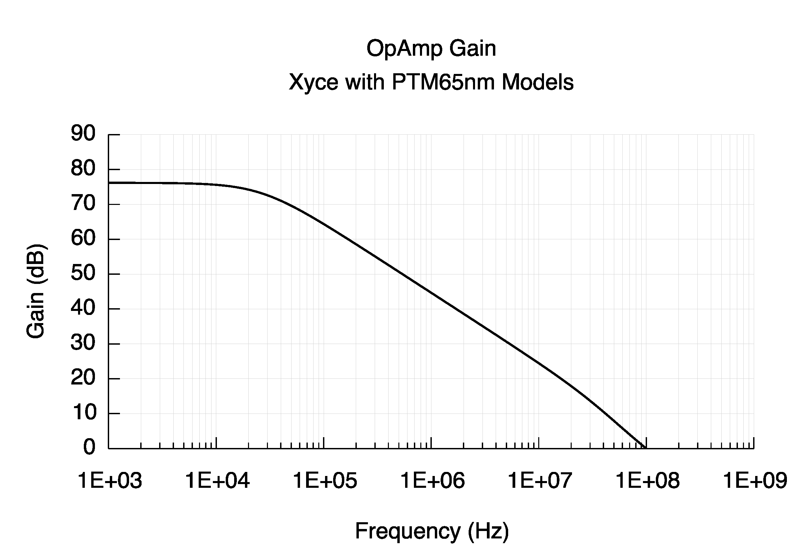

Copyright 2020

Licensed under the Apache License, Version 2.0 (the "License");
you may not use this file except in compliance with the License.
You may obtain a copy of the License at

    http://www.apache.org/licenses/LICENSE-2.0

Unless required by applicable law or agreed to in writing, software
distributed under the License is distributed on an "AS IS" BASIS,
WITHOUT WARRANTIES OR CONDITIONS OF ANY KIND, either express or implied.
See the License for the specific language governing permissions and
limitations under the License.

# README
There are 2 versions of the netlist:
## test_opamp.cir
This netlist can be used to compute gain from V(dolout) as a post-process in gnuplot.
## test_opamp_gain.cir
This netlist computes gain directly so it doesn’t need a post-process step.
## Gain and IM3 scripts
The included m-files should be compatible with GNU Octave (<https://www.gnu.org/software/octave/>), which is open-source under the GNU GPL license (<https://www.gnu.org/software/octave/license.html>).

For plotting the gain (done here for the op-amp), the included scripts aren't necessary, as the relevant result is simply in the .prn file produced by Xyce. For plotting the IM3 calculation, however, these scripts are needed to compute the FFT and plot. The main script to run is specXyce.m, which calls plotXyce.m.

## OpAmp Gain: Xyce with PTM65nm Models

